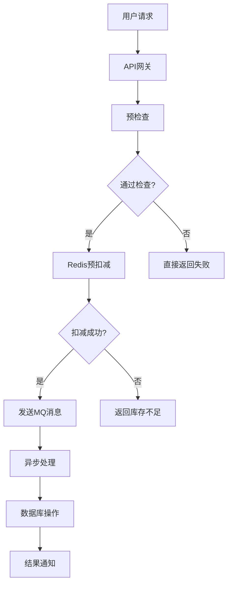
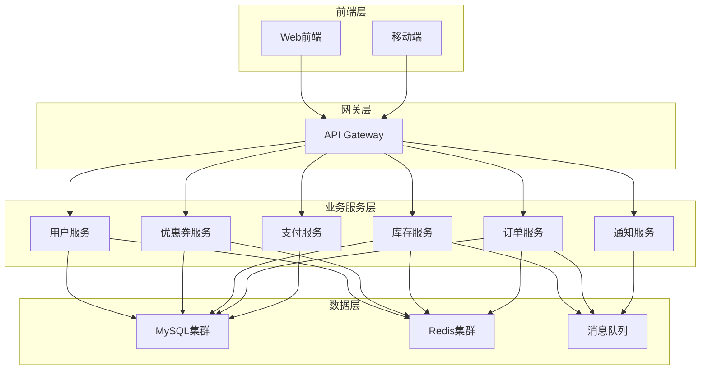
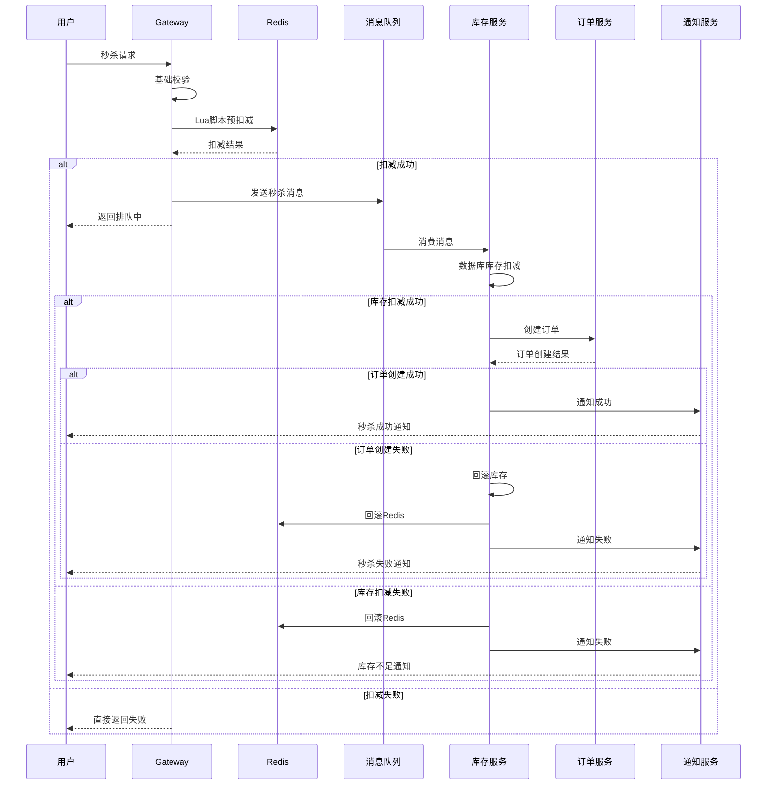
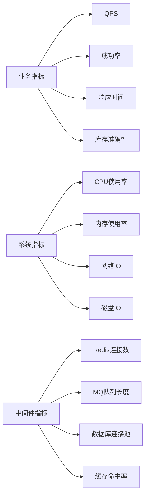

# 分布式秒杀系统架构设计方案

## 目录
- [1. 系统概述](#1-系统概述)
- [2. 微服务架构设计](#2-微服务架构设计)
- [3. 核心解决方案](#3-核心解决方案)
- [4. 技术实现](#4-技术实现)
- [5. 监控与容错](#5-监控与容错)
- [6. 部署架构](#6-部署架构)

## 1. 系统概述

### 1.1 业务挑战
- **超卖问题**: 高并发下库存扣减的原子性保证
- **一人一单**: 防止用户重复购买同一商品
- **系统性能**: 支持万级并发请求
- **数据一致性**: 分布式环境下的最终一致性

### 1.2 解决思路


## 2. 微服务架构设计

### 2.1 服务拆分



### 2.2 服务职责

| 服务 | 职责 | 数据库表 |
|------|------|----------|
| 用户服务 | 用户认证、信息管理 | users |
| 优惠券服务 | 优惠券信息管理 | vouchers, seckill_vouchers |
| 库存服务 | 库存管理、扣减 | stock |
| 订单服务 | 订单创建、管理 | orders |
| 支付服务 | 支付处理 | payments |
| 通知服务 | 消息推送 | notifications |

## 3. 核心解决方案

### 3.1 方案一：Redis预扣减 + MQ异步处理

#### 3.1.1 架构流程



#### 3.1.2 核心代码实现

##### Gateway层预扣减

```go
package gateway

import (
    "context"
    "encoding/json"
    "fmt"
    "time"
    
    "github.com/go-redis/redis/v8"
    "github.com/streadway/amqp"
)

// SeckillRequest 秒杀请求
type SeckillRequest struct {
    UserID    uint `json:"user_id"`
    VoucherID uint `json:"voucher_id"`
}

// SeckillResponse 秒杀响应
type SeckillResponse struct {
    Code    int    `json:"code"`
    Message string `json:"message"`
    Data    interface{} `json:"data,omitempty"`
}

// SeckillGateway 秒杀网关
type SeckillGateway struct {
    redis  *redis.Client
    mq     *amqp.Channel
    config *Config
}

// PreDeductStock Redis预扣减库存
func (g *SeckillGateway) PreDeductStock(ctx context.Context, req SeckillRequest) (*SeckillResponse, error) {
    // Lua脚本：原子性检查和扣减
    script := `
        local stockKey = KEYS[1]
        local userKey = KEYS[2]
        local timeKey = KEYS[3]
        
        local userId = ARGV[1]
        local currentTime = tonumber(ARGV[2])
        local beginTime = tonumber(ARGV[3])
        local endTime = tonumber(ARGV[4])
        
        -- 检查秒杀时间
        if currentTime < beginTime then
            return {0, "秒杀尚未开始"}
        end
        
        if currentTime > endTime then
            return {0, "秒杀已结束"}
        end
        
        -- 检查库存
        local stock = redis.call('GET', stockKey)
        if not stock or tonumber(stock) <= 0 then
            return {0, "库存不足"}
        end
        
        -- 检查用户是否已购买
        if redis.call('EXISTS', userKey) == 1 then
            return {0, "不能重复购买"}
        end
        
        -- 扣减库存并标记用户
        redis.call('DECR', stockKey)
        redis.call('SETEX', userKey, 3600, userId)
        
        return {1, "预扣减成功"}
    `
    
    stockKey := fmt.Sprintf("seckill:stock:%d", req.VoucherID)
    userKey := fmt.Sprintf("seckill:user:%d:%d", req.UserID, req.VoucherID)
    timeKey := fmt.Sprintf("seckill:time:%d", req.VoucherID)
    
    // 获取秒杀时间信息
    beginTime, endTime, err := g.getSeckillTime(ctx, req.VoucherID)
    if err != nil {
        return &SeckillResponse{Code: 500, Message: "系统错误"}, err
    }
    
    result := g.redis.Eval(ctx, script, 
        []string{stockKey, userKey, timeKey},
        req.UserID, time.Now().Unix(), beginTime, endTime,
    )
    
    vals, err := result.Result()
    if err != nil {
        return &SeckillResponse{Code: 500, Message: "系统错误"}, err
    }
    
    resultSlice := vals.([]interface{})
    success := resultSlice[0].(int64)
    message := resultSlice[1].(string)
    
    if success == 1 {
        // 发送消息到MQ
        err = g.sendToMQ(SeckillMessage{
            UserID:    req.UserID,
            VoucherID: req.VoucherID,
            Timestamp: time.Now(),
            TraceID:   generateTraceID(),
        })
        
        if err != nil {
            // 回滚Redis操作
            g.rollbackRedis(ctx, req.UserID, req.VoucherID)
            return &SeckillResponse{Code: 500, Message: "系统繁忙"}, err
        }
        
        return &SeckillResponse{
            Code:    200,
            Message: "排队中，请稍后查询结果",
            Data:    map[string]interface{}{"trace_id": generateTraceID()},
        }, nil
    }
    
    return &SeckillResponse{Code: 400, Message: message}, nil
}

// SeckillMessage 秒杀消息
type SeckillMessage struct {
    UserID    uint      `json:"user_id"`
    VoucherID uint      `json:"voucher_id"`
    Timestamp time.Time `json:"timestamp"`
    TraceID   string    `json:"trace_id"`
}

// sendToMQ 发送消息到队列
func (g *SeckillGateway) sendToMQ(msg SeckillMessage) error {
    body, err := json.Marshal(msg)
    if err != nil {
        return err
    }
    
    return g.mq.Publish(
        "seckill.exchange", // exchange
        "seckill.queue",    // routing key
        false,              // mandatory
        false,              // immediate
        amqp.Publishing{
            ContentType:  "application/json",
            Body:         body,
            DeliveryMode: amqp.Persistent, // 持久化
            Timestamp:    time.Now(),
        },
    )
}
```

##### 库存服务消费者

```go
package stock

import (
    "context"
    "encoding/json"
    "fmt"
    "log"
    "time"
    
    "github.com/streadway/amqp"
    "gorm.io/gorm"
)

// StockService 库存服务
type StockService struct {
    db          *gorm.DB
    redis       *redis.Client
    orderClient OrderServiceClient
    notifyClient NotifyServiceClient
}

// ProcessSeckillMessage 处理秒杀消息
func (s *StockService) ProcessSeckillMessage(delivery amqp.Delivery) {
    var msg SeckillMessage
    if err := json.Unmarshal(delivery.Body, &msg); err != nil {
        log.Printf("解析消息失败: %v", err)
        delivery.Nack(false, false) // 拒绝消息，不重新入队
        return
    }
    
    ctx := context.Background()
    
    // 幂等性检查
    if s.isProcessed(ctx, msg.TraceID) {
        delivery.Ack(false)
        return
    }
    
    // 处理秒杀逻辑
    err := s.processSeckill(ctx, msg)
    if err != nil {
        log.Printf("处理秒杀失败: %v", err)
        
        // 根据错误类型决定是否重试
        if s.shouldRetry(err) {
            delivery.Nack(false, true) // 重新入队
        } else {
            delivery.Nack(false, false) // 不重新入队
            s.handleFailure(ctx, msg, err)
        }
        return
    }
    
    delivery.Ack(false)
    s.markProcessed(ctx, msg.TraceID)
}

// processSeckill 处理秒杀核心逻辑
func (s *StockService) processSeckill(ctx context.Context, msg SeckillMessage) error {
    // 开始数据库事务
    tx := s.db.Begin()
    if tx.Error != nil {
        return fmt.Errorf("开始事务失败: %w", tx.Error)
    }
    defer tx.Rollback()
    
    // 1. 扣减数据库库存
    err := s.deductDatabaseStock(tx, msg.VoucherID, 1)
    if err != nil {
        s.rollbackRedisStock(ctx, msg.VoucherID, msg.UserID)
        return fmt.Errorf("扣减库存失败: %w", err)
    }
    
    // 2. 调用订单服务创建订单
    orderReq := &CreateOrderRequest{
        UserID:    msg.UserID,
        VoucherID: msg.VoucherID,
        TraceID:   msg.TraceID,
    }
    
    orderResp, err := s.orderClient.CreateOrder(ctx, orderReq)
    if err != nil {
        s.rollbackDatabaseStock(tx, msg.VoucherID, 1)
        s.rollbackRedisStock(ctx, msg.VoucherID, msg.UserID)
        return fmt.Errorf("创建订单失败: %w", err)
    }
    
    // 3. 提交事务
    if err := tx.Commit().Error; err != nil {
        s.rollbackRedisStock(ctx, msg.VoucherID, msg.UserID)
        return fmt.Errorf("提交事务失败: %w", err)
    }
    
    // 4. 通知用户成功
    s.notifyClient.SendSuccess(ctx, &NotifyRequest{
        UserID:  msg.UserID,
        OrderID: orderResp.OrderID,
        Message: "秒杀成功",
    })
    
    return nil
}

// deductDatabaseStock 扣减数据库库存
func (s *StockService) deductDatabaseStock(tx *gorm.DB, voucherID uint, quantity int) error {
    result := tx.Model(&SeckillVoucher{}).
        Where("voucher_id = ? AND stock >= ?", voucherID, quantity).
        Update("stock", gorm.Expr("stock - ?", quantity))
    
    if result.Error != nil {
        return result.Error
    }
    
    if result.RowsAffected == 0 {
        return fmt.Errorf("库存不足")
    }
    
    return nil
}

// rollbackRedisStock 回滚Redis库存
func (s *StockService) rollbackRedisStock(ctx context.Context, voucherID, userID uint) {
    script := `
        local stockKey = KEYS[1]
        local userKey = KEYS[2]
        
        redis.call('INCR', stockKey)
        redis.call('DEL', userKey)
        
        return 1
    `
    
    stockKey := fmt.Sprintf("seckill:stock:%d", voucherID)
    userKey := fmt.Sprintf("seckill:user:%d:%d", userID, voucherID)
    
    s.redis.Eval(ctx, script, []string{stockKey, userKey})
}
```

### 3.2 方案二：Saga分布式事务模式

#### 3.2.1 Saga编排器

```go
package saga

import (
    "context"
    "fmt"
    "log"
)

// SagaStep Saga步骤
type SagaStep struct {
    Name        string
    Service     string
    Action      string
    Compensate  string
    Data        interface{}
    Executed    bool
}

// SeckillSaga 秒杀Saga
type SeckillSaga struct {
    ID       string
    Steps    []SagaStep
    Status   string
    services map[string]ServiceClient
}

// Execute 执行Saga
func (s *SeckillSaga) Execute(ctx context.Context) error {
    s.Status = "EXECUTING"
    
    for i, step := range s.Steps {
        log.Printf("执行步骤: %s", step.Name)
        
        err := s.executeStep(ctx, &s.Steps[i])
        if err != nil {
            log.Printf("步骤执行失败: %s, 错误: %v", step.Name, err)
            
            // 执行补偿操作
            s.compensate(ctx, i-1)
            s.Status = "FAILED"
            return err
        }
        
        s.Steps[i].Executed = true
    }
    
    s.Status = "COMPLETED"
    return nil
}

// executeStep 执行单个步骤
func (s *SeckillSaga) executeStep(ctx context.Context, step *SagaStep) error {
    service, exists := s.services[step.Service]
    if !exists {
        return fmt.Errorf("服务不存在: %s", step.Service)
    }
    
    return service.Execute(ctx, step.Action, step.Data)
}

// compensate 执行补偿操作
func (s *SeckillSaga) compensate(ctx context.Context, lastExecutedIndex int) {
    for i := lastExecutedIndex; i >= 0; i-- {
        step := s.Steps[i]
        if !step.Executed || step.Compensate == "" {
            continue
        }
        
        log.Printf("执行补偿: %s", step.Name)
        
        service := s.services[step.Service]
        err := service.Execute(ctx, step.Compensate, step.Data)
        if err != nil {
            log.Printf("补偿失败: %s, 错误: %v", step.Name, err)
        }
    }
}

// CreateSeckillSaga 创建秒杀Saga
func CreateSeckillSaga(userID, voucherID uint, services map[string]ServiceClient) *SeckillSaga {
    return &SeckillSaga{
        ID: generateSagaID(),
        Steps: []SagaStep{
            {
                Name:       "检查用户",
                Service:    "user",
                Action:     "checkUser",
                Compensate: "",
                Data:       map[string]interface{}{"user_id": userID},
            },
            {
                Name:       "检查优惠券",
                Service:    "voucher",
                Action:     "checkVoucher",
                Compensate: "",
                Data:       map[string]interface{}{"voucher_id": voucherID},
            },
            {
                Name:       "扣减库存",
                Service:    "stock",
                Action:     "deductStock",
                Compensate: "rollbackStock",
                Data:       map[string]interface{}{"voucher_id": voucherID, "quantity": 1},
            },
            {
                Name:       "创建订单",
                Service:    "order",
                Action:     "createOrder",
                Compensate: "cancelOrder",
                Data:       map[string]interface{}{"user_id": userID, "voucher_id": voucherID},
            },
        },
        services: services,
        Status:   "PENDING",
    }
}
```

## 4. 技术实现

### 4.1 消息队列配置

#### RabbitMQ配置

```go
package mq

import (
    "log"
    "github.com/streadway/amqp"
)

// RabbitMQConfig RabbitMQ配置
type RabbitMQConfig struct {
    URL          string
    Exchange     string
    Queue        string
    RoutingKey   string
    DeadLetter   string
    MaxRetries   int
}

// SetupRabbitMQ 设置RabbitMQ
func SetupRabbitMQ(config *RabbitMQConfig) (*amqp.Channel, error) {
    conn, err := amqp.Dial(config.URL)
    if err != nil {
        return nil, err
    }
    
    ch, err := conn.Channel()
    if err != nil {
        return nil, err
    }
    
    // 声明交换机
    err = ch.ExchangeDeclare(
        config.Exchange, // name
        "direct",        // type
        true,            // durable
        false,           // auto-deleted
        false,           // internal
        false,           // no-wait
        nil,             // arguments
    )
    if err != nil {
        return nil, err
    }
    
    // 声明死信交换机
    err = ch.ExchangeDeclare(
        config.DeadLetter+".exchange",
        "direct",
        true,
        false,
        false,
        false,
        nil,
    )
    if err != nil {
        return nil, err
    }
    
    // 声明主队列
    _, err = ch.QueueDeclare(
        config.Queue, // name
        true,         // durable
        false,        // delete when unused
        false,        // exclusive
        false,        // no-wait
        amqp.Table{
            "x-dead-letter-exchange":    config.DeadLetter + ".exchange",
            "x-dead-letter-routing-key": config.DeadLetter + ".queue",
            "x-message-ttl":             300000, // 5分钟TTL
        },
    )
    if err != nil {
        return nil, err
    }
    
    // 声明死信队列
    _, err = ch.QueueDeclare(
        config.DeadLetter+".queue",
        true,
        false,
        false,
        false,
        nil,
    )
    if err != nil {
        return nil, err
    }
    
    // 绑定队列
    err = ch.QueueBind(
        config.Queue,
        config.RoutingKey,
        config.Exchange,
        false,
        nil,
    )
    if err != nil {
        return nil, err
    }
    
    // 绑定死信队列
    err = ch.QueueBind(
        config.DeadLetter+".queue",
        config.DeadLetter+".queue",
        config.DeadLetter+".exchange",
        false,
        nil,
    )
    
    return ch, err
}
```

### 4.2 Redis配置

```go
package redis

import (
    "context"
    "time"
    
    "github.com/go-redis/redis/v8"
)

// RedisConfig Redis配置
type RedisConfig struct {
    Addr         string
    Password     string
    DB           int
    PoolSize     int
    MinIdleConns int
}

// NewRedisClient 创建Redis客户端
func NewRedisClient(config *RedisConfig) *redis.Client {
    return redis.NewClient(&redis.Options{
        Addr:         config.Addr,
        Password:     config.Password,
        DB:           config.DB,
        PoolSize:     config.PoolSize,
        MinIdleConns: config.MinIdleConns,
        DialTimeout:  5 * time.Second,
        ReadTimeout:  3 * time.Second,
        WriteTimeout: 3 * time.Second,
        PoolTimeout:  4 * time.Second,
    })
}

// InitSeckillStock 初始化秒杀库存
func InitSeckillStock(ctx context.Context, client *redis.Client, voucherID uint, stock int) error {
    key := fmt.Sprintf("seckill:stock:%d", voucherID)
    return client.Set(ctx, key, stock, 24*time.Hour).Err()
}
```

## 5. 监控与容错

### 5.1 监控指标



### 5.2 容错机制

```go
package circuit

import (
    "context"
    "errors"
    "sync"
    "time"
)

// CircuitBreaker 熔断器
type CircuitBreaker struct {
    mu           sync.RWMutex
    state        State
    failureCount int
    lastFailTime time.Time
    timeout      time.Duration
    threshold    int
}

type State int

const (
    StateClosed State = iota
    StateOpen
    StateHalfOpen
)

// Execute 执行函数
func (cb *CircuitBreaker) Execute(ctx context.Context, fn func() error) error {
    cb.mu.RLock()
    state := cb.state
    cb.mu.RUnlock()
    
    switch state {
    case StateOpen:
        if time.Since(cb.lastFailTime) > cb.timeout {
            cb.mu.Lock()
            cb.state = StateHalfOpen
            cb.mu.Unlock()
        } else {
            return errors.New("circuit breaker is open")
        }
    case StateHalfOpen:
        // 半开状态，尝试执行
    case StateClosed:
        // 关闭状态，正常执行
    }
    
    err := fn()
    
    cb.mu.Lock()
    defer cb.mu.Unlock()
    
    if err != nil {
        cb.failureCount++
        cb.lastFailTime = time.Now()
        
        if cb.failureCount >= cb.threshold {
            cb.state = StateOpen
        }
        
        return err
    }
    
    // 成功执行，重置计数器
    cb.failureCount = 0
    cb.state = StateClosed
    
    return nil
}
```

### 5.3 重试机制

```go
package retry

import (
    "context"
    "time"
)

// RetryConfig 重试配置
type RetryConfig struct {
    MaxRetries int
    BackoffMs  []int // 退避时间
}

// WithRetry 带重试的执行
func WithRetry(ctx context.Context, config *RetryConfig, fn func() error) error {
    var lastErr error
    
    for i := 0; i <= config.MaxRetries; i++ {
        if i > 0 {
            // 指数退避
            backoff := time.Duration(config.BackoffMs[min(i-1, len(config.BackoffMs)-1)]) * time.Millisecond
            
            select {
            case <-ctx.Done():
                return ctx.Err()
            case <-time.After(backoff):
            }
        }
        
        err := fn()
        if err == nil {
            return nil
        }
        
        lastErr = err
        
        // 检查是否应该重试
        if !shouldRetry(err) {
            break
        }
    }
    
    return lastErr
}

func shouldRetry(err error) bool {
    // 根据错误类型判断是否应该重试
    // 例如：网络错误可以重试，业务逻辑错误不重试
    return true
}

func min(a, b int) int {
    if a < b {
        return a
    }
    return b
}
```

## 6. 部署架构

### 6.1 容器化部署

```yaml
# docker-compose.yml
version: '3.8'

services:
  # API网关
  gateway:
    image: seckill/gateway:latest
    ports:
      - "8080:8080"
    environment:
      - REDIS_URL=redis:6379
      - MQ_URL=amqp://rabbitmq:5672
    depends_on:
      - redis
      - rabbitmq
    deploy:
      replicas: 3
  
  # 库存服务
  stock-service:
    image: seckill/stock-service:latest
    environment:
      - DB_URL=mysql://mysql:3306/seckill
      - REDIS_URL=redis:6379
      - MQ_URL=amqp://rabbitmq:5672
    depends_on:
      - mysql
      - redis
      - rabbitmq
    deploy:
      replicas: 2
  
  # 订单服务
  order-service:
    image: seckill/order-service:latest
    environment:
      - DB_URL=mysql://mysql:3306/seckill
    depends_on:
      - mysql
    deploy:
      replicas: 2
  
  # Redis
  redis:
    image: redis:6-alpine
    ports:
      - "6379:6379"
    volumes:
      - redis_data:/data
  
  # RabbitMQ
  rabbitmq:
    image: rabbitmq:3-management
    ports:
      - "5672:5672"
      - "15672:15672"
    environment:
      - RABBITMQ_DEFAULT_USER=admin
      - RABBITMQ_DEFAULT_PASS=admin
    volumes:
      - rabbitmq_data:/var/lib/rabbitmq
  
  # MySQL
  mysql:
    image: mysql:8.0
    ports:
      - "3306:3306"
    environment:
      - MYSQL_ROOT_PASSWORD=root
      - MYSQL_DATABASE=seckill
    volumes:
      - mysql_data:/var/lib/mysql

volumes:
  redis_data:
  rabbitmq_data:
  mysql_data:
```

### 6.2 Kubernetes部署

```yaml
# k8s-deployment.yaml
apiVersion: apps/v1
kind: Deployment
metadata:
  name: seckill-gateway
spec:
  replicas: 3
  selector:
    matchLabels:
      app: seckill-gateway
  template:
    metadata:
      labels:
        app: seckill-gateway
    spec:
      containers:
      - name: gateway
        image: seckill/gateway:latest
        ports:
        - containerPort: 8080
        env:
        - name: REDIS_URL
          value: "redis-service:6379"
        - name: MQ_URL
          value: "amqp://rabbitmq-service:5672"
        resources:
          requests:
            memory: "256Mi"
            cpu: "250m"
          limits:
            memory: "512Mi"
            cpu: "500m"
        livenessProbe:
          httpGet:
            path: /health
            port: 8080
          initialDelaySeconds: 30
          periodSeconds: 10
        readinessProbe:
          httpGet:
            path: /ready
            port: 8080
          initialDelaySeconds: 5
          periodSeconds: 5
---
apiVersion: v1
kind: Service
metadata:
  name: seckill-gateway-service
spec:
  selector:
    app: seckill-gateway
  ports:
  - port: 80
    targetPort: 8080
  type: LoadBalancer
```

## 总结

本方案通过微服务架构和消息队列，实现了高并发秒杀系统的以下目标：

1. **高性能**: Redis预扣减 + 异步处理，支持万级并发
2. **数据一致性**: 通过Saga模式和补偿机制保证最终一致性
3. **高可用**: 熔断器、重试机制、多副本部署
4. **可扩展**: 微服务架构，各服务可独立扩展
5. **可监控**: 完善的监控指标和告警机制

该架构在保证业务正确性的同时，提供了优秀的性能和用户体验。